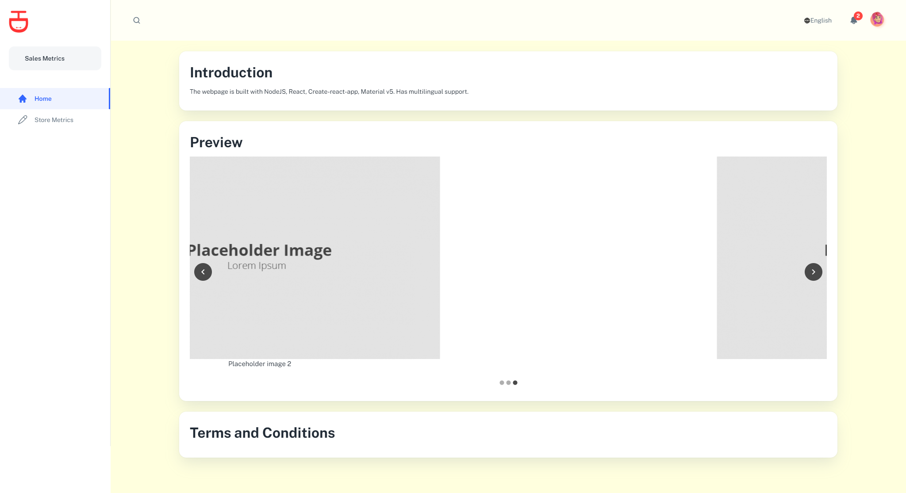
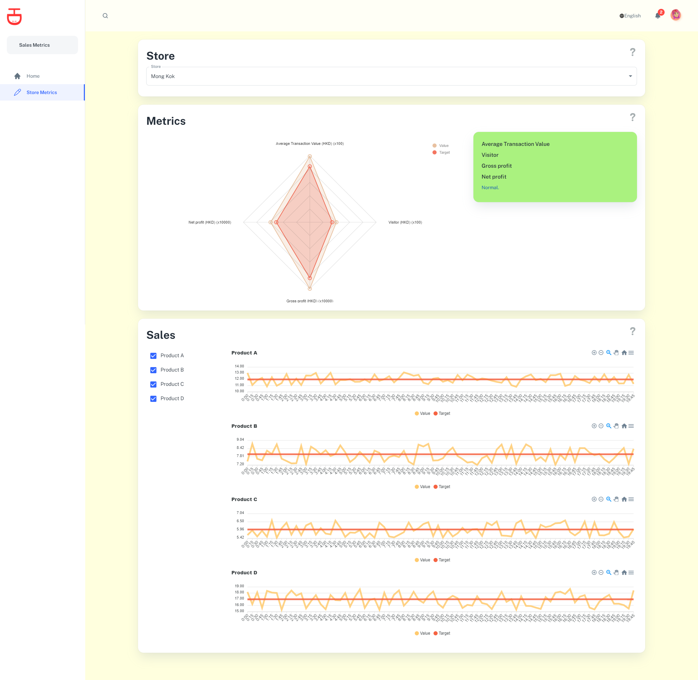

# Introduction
The webpage is built with NodeJS, React, Create-react-app, Material v5. Has multilingual support.

## Getting started
First, make sure your have **Node.js** (and npm) installed. Clone the git repository. The run the following commands:

    npm install
    npm start

Your default browser should open pointing at `http://localhost:3000`. Enjoy!

## Screenshots

### HomePage

